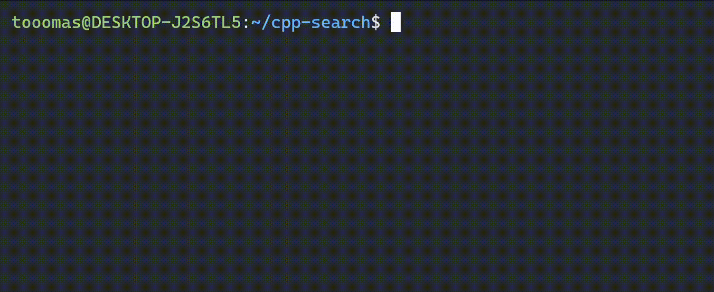

# search - With Better UX
`search` is a program to search the desired folder/file in your file system. `search` is similar to the `find` and `fd` program, but provides a better user experience to select a specific search result.

## No More Copy & Paste


## Installation

### Requirement:
  - `cmake` with version 3.10+
  - `g++` / `clang++` compiler
  - UNIX environemnt

### Steps:
  1. Clone this repository into your working directory using `git clone` command
  2. Change the directory to the cloned directory
  3. Compile the program as an executable `search`
  4. Move the program to the directory `/usr/bin`, it requires superuser permission
      ```bash
      sudo mv /build/search /usr/bin/search
      ```

## How to Use
The program uses the following syntax:
```bash
search [OPTIONS]... [PATTERN]
```
### Pattern
The program supports searching with the use of REgex. For example,

`search \.cpp$` - to search all the files end with cpp extension in the current working directory.

`search cpp` - to search all the files/folders containing the word `cpp`.

### Options
Currently, the program only supports the flags `-s`, `-source`.

| flags | descriptions  | example |
| ------------ | ------------ | ------------ |
|  `-s`, `-source` |  This flag set the root directory of the searching | `search -s src` |

### Using the Program
The program contains two modes: (1) **Control Mode**, and (2) **Command Mode**. By default, the Control Mode is on.

#### Quit the Program
`Control Mode Only` You can quit the program by pressing the key `q`

#### Moving Around
`Control Mode Only` You can move the page up and down by using the `Arrow Up` / `k` and `Arrow Down` / `j` respectively.

#### Command Execution
`Command Mode Only` To enter **Command Mode**, type `:`. After entering the Command Mode, you can start typing the command. To switch back to Control Mode, press the key `ESC`.

You can use the listed number on the left to use as the arguments of your command with the format `_index`. To include all the listed items, use the symbol `_0`. For example,
```bash
: vim _1 #It opens the listed file with index 1 in the vim editor 
```